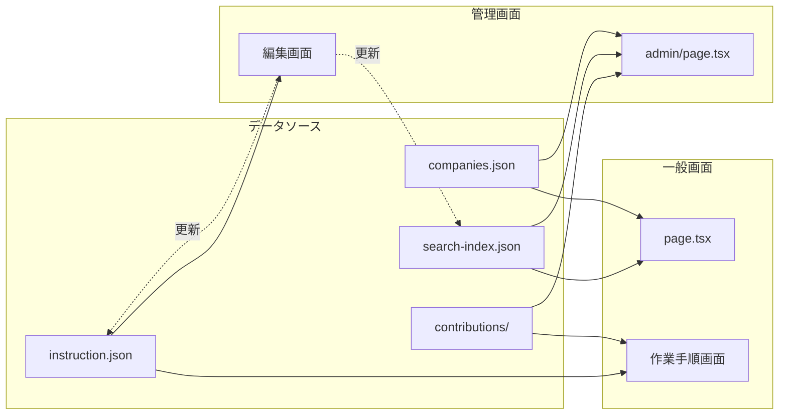
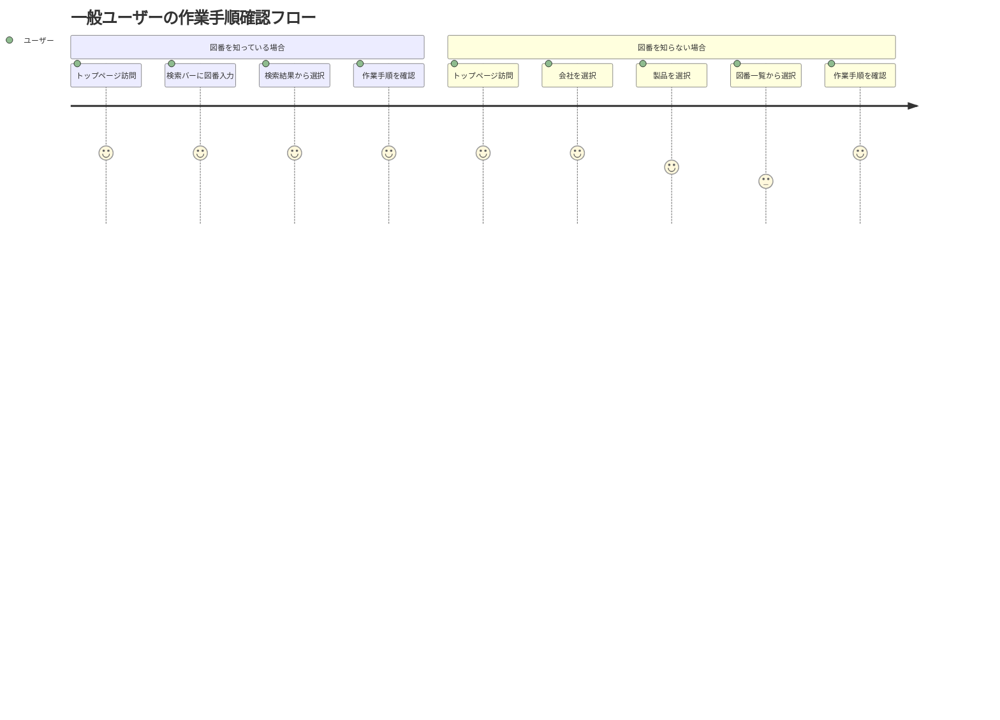
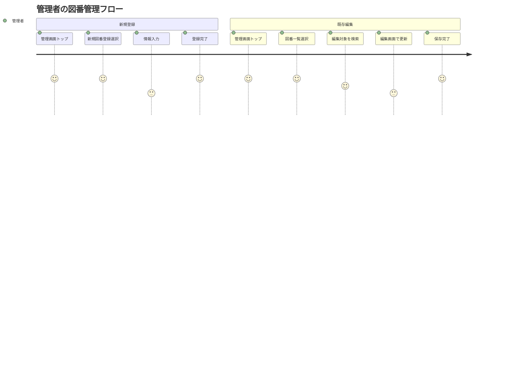
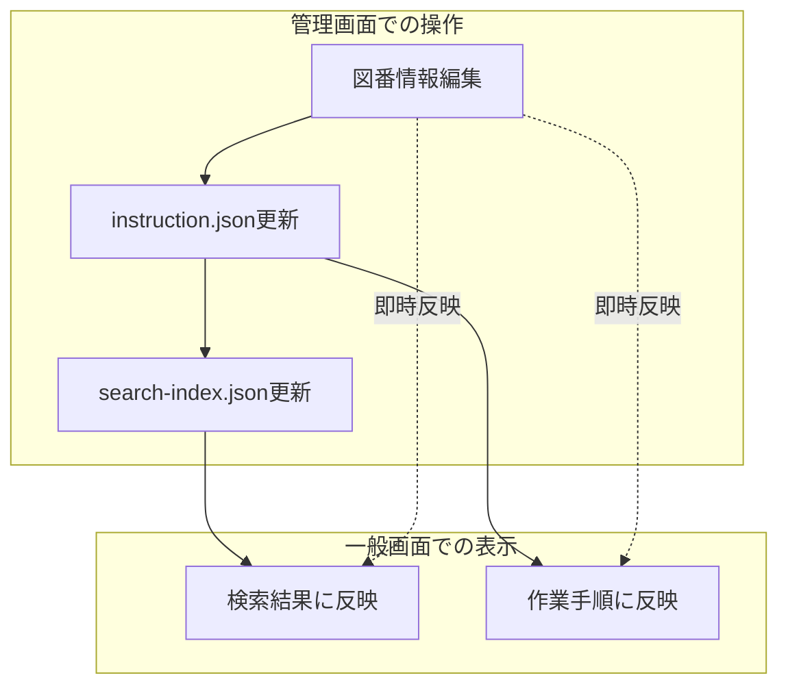
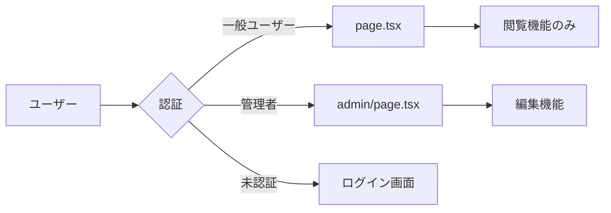

# システム全体フロー図 - Work Record Database

## 1. システム全体の構成

```mermaid
graph TB
    subgraph "一般ユーザー向け（閲覧系）"
        A[page.tsx<br/>トップページ] --> B[category/[id]<br/>製品選択]
        B --> C[drawings/[category]<br/>図番選択]
        C --> D[instruction/[drawingNumber]<br/>作業手順詳細]
        A -.検索.-> D
        A -.最新追記.-> D
    end
    
    subgraph "管理者向け（管理系）"
        E[admin/page.tsx<br/>管理画面トップ] --> F[admin/drawings/new<br/>新規登録]
        E --> G[admin/drawings/list<br/>一覧・検索]
        G --> H[admin/drawings/[id]/edit<br/>編集画面]
        E --> I[admin/companies<br/>会社管理]
        E --> J[admin/contributions<br/>追記管理]
        E --> K[admin/tools/validate<br/>整合性チェック]
    end
    
    A <-.-> E
    D -.追記表示.-> J
```

## 2. 両画面の関連性

### 2.1 データフローの観点



### 2.2 機能の対比

| 機能 | 一般画面（page.tsx） | 管理画面（admin/page.tsx） |
|------|---------------------|--------------------------|
| **主目的** | 作業手順の検索・閲覧 | データの管理・編集 |
| **対象ユーザー** | 現場作業者 | システム管理者 |
| **データ操作** | 読み取り専用 | CRUD操作 |
| **認証** | 不要 | 必要（将来実装） |
| **UI/UX** | ダークテーマ・視認性重視 | ライトテーマ・機能性重視 |

## 3. ユーザージャーニー

### 3.1 一般ユーザーのフロー



### 3.2 管理者のフロー



## 4. 画面間の遷移パターン

### 4.1 相互遷移

1. **一般 → 管理**
   - 現在は直接リンクなし
   - URLを知っている管理者のみアクセス可能

2. **管理 → 一般**
   - ヘッダーの「メインサイトに戻る」リンク
   - 最新追記の図番リンク（閲覧確認用）

### 4.2 データの一貫性



## 5. セキュリティとアクセス制御

### 現在の状態
- 一般画面: 完全公開（認証不要）
- 管理画面: URL直接アクセス（認証未実装）

### 将来の実装予定


## 6. 技術的な共通点と相違点

### 共通点
- Next.js App Router使用
- Client Componentとして実装
- 同じデータローダー関数を使用（dataLoader.ts）
- TypeScriptによる型安全性

### 相違点

| 項目 | page.tsx | admin/page.tsx |
|------|----------|----------------|
| **スタイリング** | Tailwind (ダーク) | Tailwind (ライト) |
| **コンポーネント** | 外部コンポーネント利用 | セルフコンテインド |
| **エラー処理** | UIに表示 | コンソールのみ |
| **データ取得** | 必要最小限 | 統計情報も取得 |

## 7. 今後の統合ポイント

1. **認証システムの導入**
   - 両画面を統合的に管理
   - ロールベースアクセス制御

2. **共通ヘッダーの実装**
   - ユーザー種別に応じた表示切替
   - シームレスな画面遷移

3. **リアルタイム更新**
   - 管理画面での変更を一般画面に即座反映
   - WebSocketやSSEの活用

4. **統一的なエラーハンドリング**
   - エラー表示の一貫性
   - ユーザーフレンドリーなメッセージ