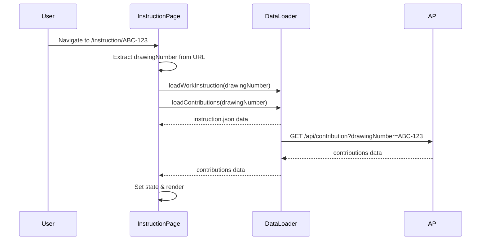
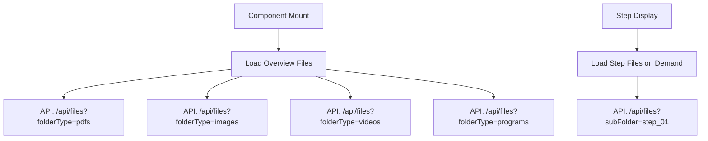
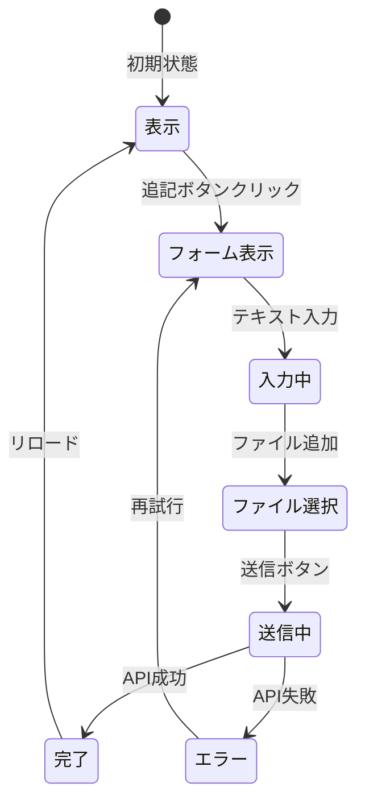

# 画面詳細仕様書 - instruction/[drawingNumber]/page.tsx（作業詳細ページ）

## 1. 画面概要

### 基本情報
- **ファイルパス**: `src/app/instruction/[drawingNumber]/page.tsx`
- **URL**: `/instruction/{図番}`
- **画面名**: 作業手順詳細表示画面
- **役割**: プロジェクトの中核画面。作業手順の詳細表示と現場からのフィードバック収集

### 画面の目的
1. **作業手順の完全表示**: ステップごとの詳細な作業内容
2. **マルチメディア対応**: 画像・動画・PDF・プログラムファイルの統合表示
3. **双方向コミュニケーション**: 現場からの追記・改善提案の収集
4. **ナレッジ共有**: ヒヤリハット事例と加工アイデアの共有

## 2. アーキテクチャ構造

### コンポーネント階層
```
InstructionPage (Container)
└── WorkInstructionResults (Main Component)
    ├── Header Section (図番・基本情報)
    ├── Overview Media Section (概要メディア)
    ├── Tab Navigation
    │   ├── Steps Tab
    │   │   └── WorkStep × N
    │   ├── Related Tab
    │   └── Ideas Tab
    │       └── IdeaDisplay × N
    ├── ContributionDisplay (追記表示)
    └── ContributionForm (追記投稿フォーム)
```

### 状態管理構造
```typescript
// ページレベルの状態（InstructionPage）
const [workInstruction, setWorkInstruction] = useState<WorkInstruction | null>(null)
const [contributions, setContributions] = useState<ContributionFile | null>(null)
const [loading, setLoading] = useState(true)
const [error, setError] = useState<string | null>(null)

// コンポーネントレベルの状態（WorkInstructionResults）
const [activeTab, setActiveTab] = useState<'steps' | 'related' | 'ideas'>('steps')
const [overviewFiles, setOverviewFiles] = useState<{ pdfs, images, videos, programs }>
const [relatedIdeas, setRelatedIdeas] = useState<Idea[]>([])
const [showContributionForm, setShowContributionForm] = useState(false)
const [contributionTarget, setContributionTarget] = useState<{section, stepNumber?}>
```

## 3. データフロー詳細

### 初期データ読み込み


### ファイル読み込みフロー


## 4. 主要機能詳細

### 4.1 タブシステム
| タブ | 内容 | 主要コンポーネント |
|------|------|-------------------|
| **作業ステップ** | 各工程の詳細手順 | WorkStep |
| **関連図番** | 関連する他の図番リンク | Link cards |
| **加工アイデア** | 改善・効率化アイデア | IdeaDisplay |

### 4.2 メディア表示システム
```typescript
// ファイルタイプ別の表示方法
- PDF: 新規タブで開く外部リンク
- 画像: Next.js Image componentでインライン表示
- 動画: HTML5 video tagで埋め込み再生
- プログラム: ダウンロードボタン
```

### 4.3 追記システム


## 5. API連携詳細

### データ取得API
| エンドポイント | メソッド | 用途 | レスポンス |
|---------------|---------|------|-----------|
| `/data/work-instructions/drawing-{id}/instruction.json` | GET | 作業手順データ | WorkInstruction |
| `/api/contribution` | GET | 追記データ取得 | ContributionFile |
| `/api/files` | GET | ファイル一覧取得 | { files: string[] } |
| `/api/contribution` | POST | 追記投稿 | { success, contributionId } |

### エラーハンドリング
- **404エラー**: 「作業手順が見つかりません」表示
- **ネットワークエラー**: 「データの読み込みに失敗しました」表示
- **部分的失敗**: ファイル一覧は空配列として処理継続

## 6. 複雑な処理の詳細

### 6.1 非同期データ管理
```typescript
// 並列データ読み込み
useEffect(() => {
  Promise.all([
    loadWorkInstruction(drawingNumber),
    loadContributions(drawingNumber)
  ])
  // 概要ファイルは別途読み込み
  loadOverviewFiles()
  // 関連アイデアも別途読み込み
  loadRelatedIdeas()
}, [drawingNumber])
```

### 6.2 ファイルパス管理
```typescript
// 環境に応じた動的パス生成
const dataRoot = useMemo(() => getFrontendDataPath(), [])
// 実際のファイルパス例
`${dataRoot}/work-instructions/drawing-${drawingNumber}/images/overview/${filename}`
```

### 6.3 追記の統合表示
- 各セクション（概要、ステップ、一般）に対応した追記を適切な位置に表示
- 新旧フォーマット（単一/複数ファイル）の両対応
- タイムスタンプ順での表示

## 7. パフォーマンス最適化

### 遅延読み込み
- ステップごとのファイルは表示時に読み込み
- 関連アイデアは必要時のみ読み込み

### メモ化
- `useMemo`でdataRootパスをキャッシュ
- 重い計算処理の結果を保持

### 並列処理
- Promise.allで複数APIを同時実行
- 各ファイルタイプを並列で取得

## 8. UI/UX仕様

### レイアウト
- **ヘッダー**: 図番、タイトル、基本情報を大きく表示
- **メディアグリッド**: レスポンシブな2-4列グリッド
- **タブナビゲーション**: 固定位置で常に表示
- **追記セクション**: 各セクションに統合表示

### インタラクション
- **スムーズスクロール**: セクション間の移動
- **メディアプレビュー**: 画像クリックで拡大（将来実装）
- **追記フォーム**: モーダル風の表示
- **ローディング状態**: 各セクションで個別表示

## 9. セキュリティ考慮事項

### ファイルアップロード
- クライアントサイドでファイルサイズ制限（50MB/ファイル、総計100MB）
- ファイルタイプの制限（画像・動画のみ）
- ファイル数制限（最大10ファイル）

### XSS対策
- ユーザー入力は全てエスケープ
- dangerouslySetInnerHTMLは使用しない

## 10. 特記事項と課題

### 現在の制限
- 画像の拡大表示機能なし
- 動画のストリーミング未対応
- オフライン対応なし

### 将来の拡張予定
- リアルタイム追記更新（WebSocket）
- 画像アノテーション機能
- 作業完了チェックリスト
- 印刷用レイアウト

### 技術的負債
- ファイル表示処理の重複コード
- エラー処理の統一化が必要
- TypeScript型定義の一部any使用

## まとめ
この画面は、単なる表示画面ではなく、現場と管理側をつなぐ**双方向コミュニケーションプラットフォーム**として機能しています。複雑な状態管理と多様なメディア対応により、製造ノウハウの蓄積と共有を実現しています。