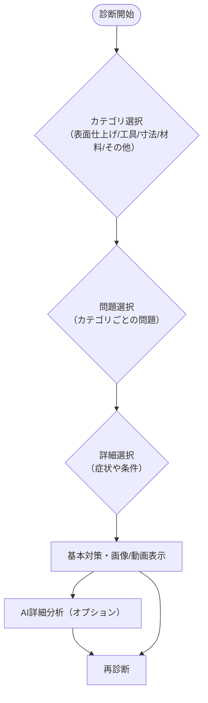

# 診断フローチャート

```mermaid
flowchart TD
    Start([診断開始])
    Category{カテゴリ選択<br>（表面仕上げ/工具/寸法/材料/その他）}
    Problem{問題選択<br>（カテゴリごとの問題）}
    Detail{詳細選択<br>（症状や条件）}
    Result[基本対策・画像/動画表示]
    AI[AI詳細分析（オプション）]
    Restart[再診断]

    Start --> Category
    Category --> Problem
    Problem --> Detail
    Detail --> Result
    Result --> AI
    AI --> Restart
    Result --> Restart
``` 